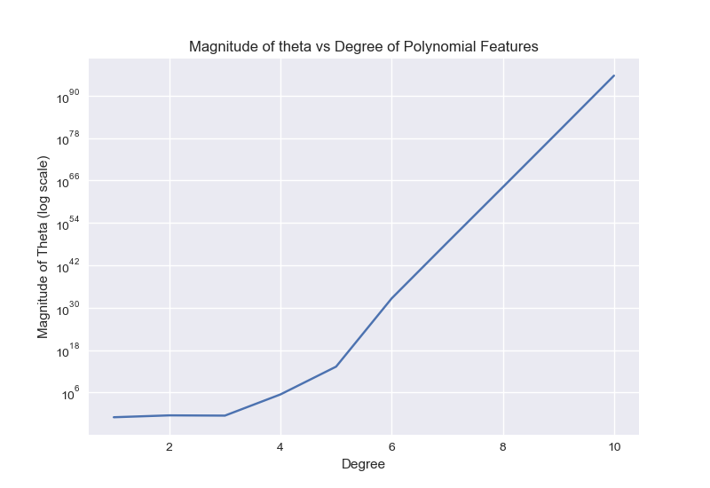

# ES654-2020 Assignment 3

*Pushkar Mujumdar* - *18110132*

------

> In this question we plot the magnitude of theta vs degree of polynomial fit. The graphs and insights are given below.

NOTE - Y axis is logarithmic

- The magnitude of theta is increasing exponentially with degree of polynomial features
- The curvature of the model gets complicated (convexity and concavity) with the introduction of higher degree features. 
- So to fit the data, model chooses higher values of theta