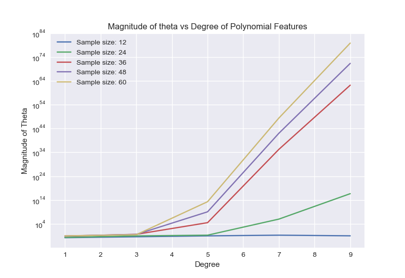

# ES654-2020 Assignment 3

*Pushkar Mujumdar* - *18110132*

------

> In this question we plot magnitude of theta vs degree for varying number of samples. The graphs and insights are given below.



- The pattern for degree follows from the previous question (exponential)
- With increasing number of samples (```N```) the magnitude of theta increases because the model tries to fit more number of samples
- The model increases thetas to more fine tune in order to fit more samples.