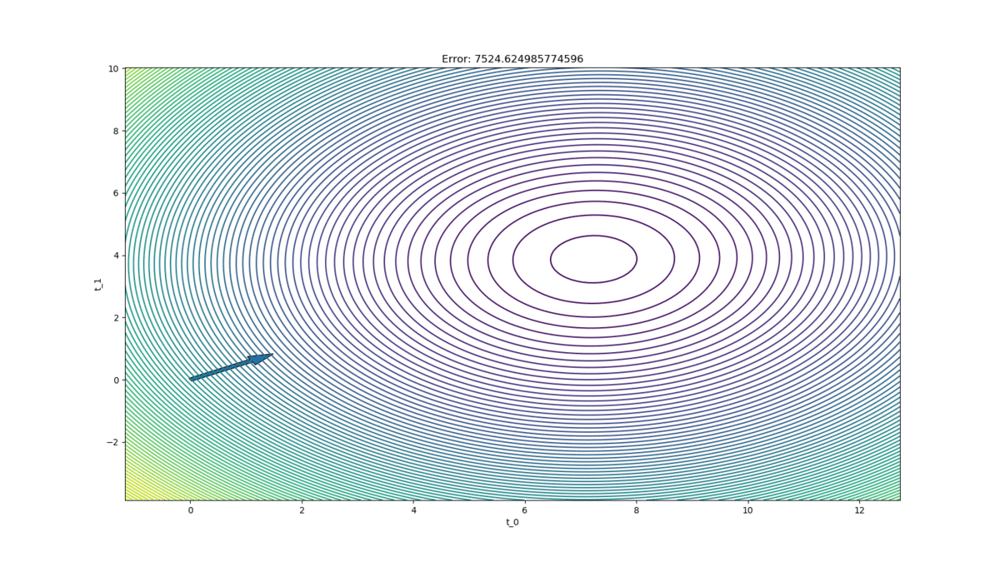

# ES654-2020 Assignment 3

*Your Name* - *Your Roll Number*

------

> The 3 GIFs and insights are given below

### Surface plot of RSS in 3D
.gif)
 

### Line Fit GIF
.gif)
 

### The contour

### Insights
As we can see from the plots, our model is doing well as the error is reducing.