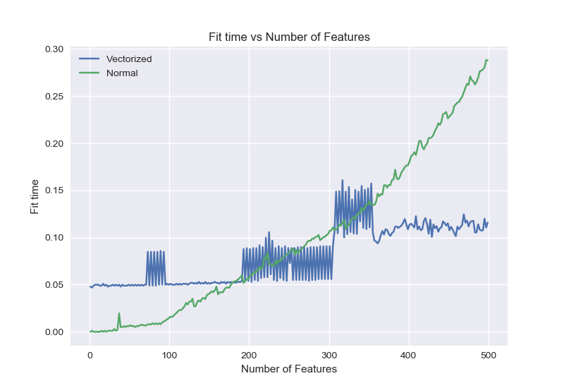
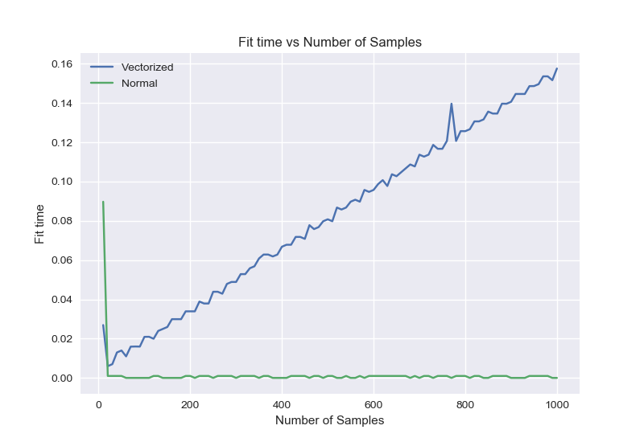

# ES654-2020 Assignment 3

*Pushkar Mujumdar* - *18110132*

------

> In this question, we study the time complexity of gradient descent and normal equation implementations of linear regression. The plots and insights are given below.




### Insights
- The theoretical time complexity of Gradient Descent is ```O(NDt)``` where ```N``` is number of samples, ```D``` is number of features and ```t``` is number of iterations.
- The theoretical time complexity of Normal Equation implementation is ```O(D^3)``` where ```D``` is the number of features.

- As we can see in our plots, the time taken vs number of features increases as expected for Normal Equation.
- However, there are a few spikes for gradient descent
- For number of samples vs time taken, the results are as expected. Normal equation is almost independent of the number of features as it should be. The Gradient Descent algorithm is linear in number of features.

The results are almost consistent with the theoretical time complexities.

